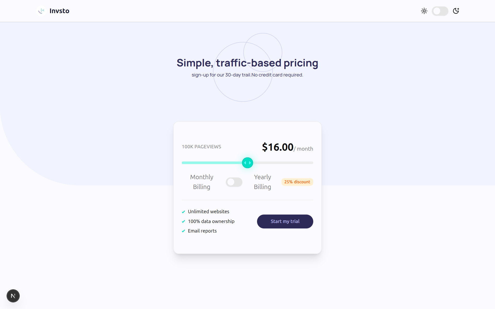
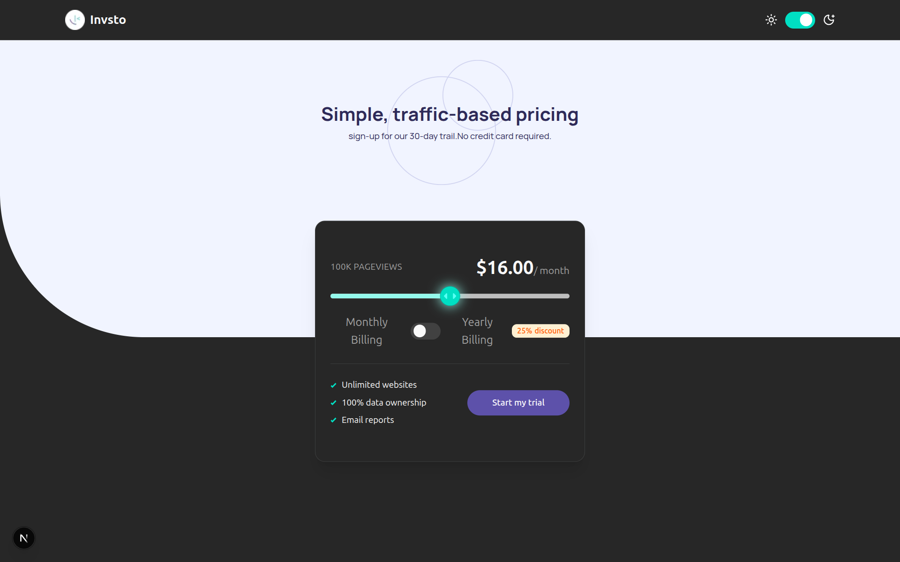

# **Frontend Mentor - Interactive pricing component solution**

This is a solution to the [Interactive pricing component challenge on Frontend Mentor](https://www.frontendmentor.io/challenges/interactive-pricing-component-t0m8PIyY8). Frontend Mentor challenges help you improve your coding skills by building realistic projects. 

## 📋 **Table of contents** 

- [Overview](#overview)
  - [The challenge](#the-challenge)
  - [Screenshots](#screenshots)
  - [Links](#links)
- [My process](#my-process)
  - [Built with](#built-with)
  - [Project Structure](#project-structure)
  - [What I learned](#what-i-learned)
  - [Continued development](#continued-development)
  - [Useful resources](#useful-resources)
- [Author](#author)
- [Acknowledgments](#acknowledgments)

## 🎯 **Overview**

### **The challenge**

Users should be able to:

- View the optimal layout for the app depending on their device's screen size
- See hover states for all interactive elements on the page
- Use the slider and toggle to see prices for different page view numbers
- Switch between monthly and yearly billing with discount calculation

### **Screenshots** 

**Light Mode**


**Dark Mode**


### **Links** 

- Solution URL: [GitHub Repository](https://github.com/dharmendra-007/invsto-task)
- Live Site URL: [Live Demo on Vercel](https://invsto-task.vercel.app/)

## **My process**

### **Built with**

- Semantic HTML5 markup
- CSS custom properties
- Flexbox & CSS Grid
- Mobile-first workflow
- [React](https://reactjs.org/) - JS library with hooks for state management
- [Next.js 15](https://nextjs.org/) - React framework with App Router
- [TypeScript](https://www.typescriptlang.org/) - Type safety and better DX
- [Tailwind CSS](https://tailwindcss.com/) - Utility-first CSS with responsive design
- [ShadCN/UI](https://ui.shadcn.com/) - Accessible component library built on Radix UI
- [Google Fonts](https://fonts.google.com/) - Geist and Manrope font families

### **Project Structure**

```
invsto-task/
├── .gitignore
├── README.md
├── components.json
├── eslint.config.mjs
├── next.config.ts
├── package-lock.json
├── package.json
├── postcss.config.mjs
├── public/
│   └── images/
│       ├── bg-pattern.svg
│       ├── icon-check.svg
│       ├── icon-slider.svg
│       ├── logo.png
│       └── pattern-circles.svg
├── src/
│   ├── app/
│   │   ├── favicon.ico
│   │   ├── globals.css
│   │   ├── layout.tsx
│   │   └── page.tsx
│   ├── components/
│   │   ├── common/
│   │   │   └── Navbar.tsx
│   │   ├── pricing/
│   │   │   └── PricingCard.tsx
│   │   └── ui/
│   │       ├── badge.tsx
│   │       ├── button.tsx
│   │       ├── card.tsx
│   │       ├── slider.tsx
│   │       └── switch.tsx
│   ├── lib/
│   │   └── utils.ts
│   └── providers/
│       └── theme-provider.tsx
└── tsconfig.json
```

### **What I learned** 

This project taught me several key concepts about building modern, interactive React applications:

**Dynamic Pricing Logic:**
```typescript
const calculatePrice = (pageviews: number, isYearly: boolean) => {
  const basePrice = getPriceForPageviews(pageviews);
  return isYearly ? basePrice * 0.75 : basePrice; // 25% yearly discount
};
```

**Custom Slider Component:**
```tsx
<Slider
  value={[sliderValue]}
  onValueChange={(value) => setSliderValue(value[0])}
  max={4}
  step={1}
  className="pricing-slider"
/>
```

**Theme Integration:**
```tsx
const ThemeProvider = ({ children }: { children: React.ReactNode }) => {
  return (
    <NextThemesProvider attribute="class" defaultTheme="system" enableSystem>
      {children}
    </NextThemesProvider>
  );
};
```

The most challenging aspect was implementing smooth price transitions while maintaining accurate calculations across different pricing tiers and billing cycles.

### Continued development

Areas I want to continue focusing on in future projects:

- **Advanced Animations** - Implementing more sophisticated micro-interactions using Framer Motion
- **Performance Optimization** - Deep diving into Next.js optimization techniques and Core Web Vitals
- **Accessibility Enhancements** - Better keyboard navigation and screen reader support
- **Testing Implementation** - Adding comprehensive unit and integration tests with Jest and Testing Library
- **State Management** - Exploring Zustand or Redux Toolkit for complex state scenarios

### **Useful resources** 

- [ShadCN/UI Documentation](https://ui.shadcn.com/) - This component library was instrumental in building a consistent, accessible design system. The pre-built components saved significant development time.
- [Tailwind CSS Grid Documentation](https://tailwindcss.com/docs/grid-template-columns) - Helped me create responsive layouts efficiently using utility classes.
- [Next.js App Router Guide](https://nextjs.org/docs/app) - Essential for understanding the new App Router paradigm and implementing proper TypeScript patterns.
- [Radix UI Primitives](https://www.radix-ui.com/) - The underlying primitives for ShadCN components taught me about building truly accessible UI components.

## **Author**

- 🌐 Website - [www.dharmendra.space](https://www.dharmendra.space)
- 🎯 Frontend Mentor - [@dharmendra-007](https://www.frontendmentor.io/profile/dharmendra-007)
- 🐦 Twitter - [@Dharmen80496076](https://x.com/Dharmen80496076)

## **Acknowledgments**

Special thanks to the Frontend Mentor community for providing such well-designed challenges that push developers to implement real-world UI patterns. The challenge specifications were clear and comprehensive, making it easier to focus on the implementation details.

Also grateful to the creators of ShadCN/UI for building such an elegant component system that combines the accessibility of Radix UI with the styling power of Tailwind CSS. This project wouldn't have been possible without these amazing open-source tools.